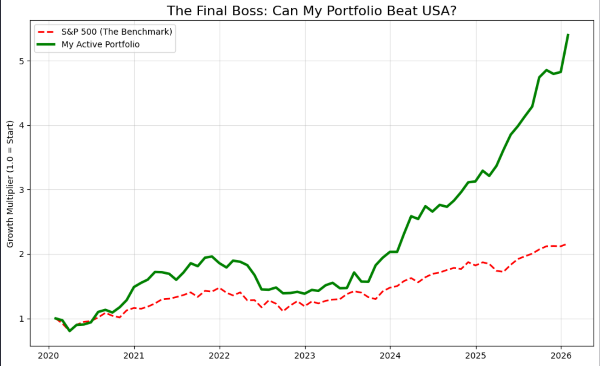

# 🛡️ Wealth Shield: Python Portfolio Optimizer

Hey, I'm Hamza. I built this project to see if I could actually beat the market using math and code instead of just guessing what to invest in. 

**The Problem:** When you invest in Pakistan, looking at a stock chart in PKR is misleading because the currency devalues (inflation). Also, holding a fixed portfolio (like 100% Bitcoin or 100% Stocks) is either too risky or too slow. 

**What I Built:**
A Python simulator that tests a multi-asset portfolio (Meezan Bank shares, Gold, and Bitcoin). It converts all PKR values to USD to show *real* returns, tests thousands of portfolio combinations, and simulates an active monthly rebalancing strategy. Finally, I benchmarked it against the US S&P 500.

---

### 🛠️ Tech Stack
* Python
* Pandas & NumPy (Data cleaning & matrix math)
* Matplotlib & Seaborn (Visualizations)

---

### ⚙️ How it Works

1. **Data Normalization:** Imported 5 years of daily prices for MEBL, Gold, and BTC. Converted PKR assets to USD to strip out inflation, and forced all assets to start at a `1.0` multiplier so they can be compared fairly.
2. **Correlation Matrix:** Used a heatmap to check the relationships between assets. Verified that Gold and BTC have very low correlation (meaning if crypto crashes, Gold stays stable).
3. **Monte Carlo Simulation:** Ran 5,000 random portfolio weight combinations to find the highest Sharpe Ratio (best reward for the lowest risk).
4. **Monthly Rebalancing Engine:** Built a time-series loop that checks the portfolio every 30 days (`.resample('M')`) and forces it back to a target split (50% Gold, 30% MEBL, 20% BTC). This acts as a bot that automatically trims winners (sells high) and buys dips (buys low).

---

### 📊 Results: My Strategy vs. S&P 500

I raced my 50/30/20 actively rebalanced portfolio against the S&P 500 (`SPY`) over the exact same 5-year timeline.

**🇺🇸 Benchmark (S&P 500)**
* Total Return: 116.17%
* Annual Growth (CAGR): 13.71%
* Worst Crash (Max Drawdown): -24.80%

**🇵🇰 My Active Strategy (50/30/20)**
* Total Return: 439.65%
* Annual Growth (CAGR): 32.43%
* Worst Crash (Max Drawdown): -29.47%

**Verdict:** The algorithm outperformed the S&P 500 by over 323 percentage points.

 

---

### 💻 How to Run
1. Clone this repository.
2. Ensure you have the `raw_data` folder with the CSV files in the same directory.
3. Run the Jupyter Notebook cell by cell.